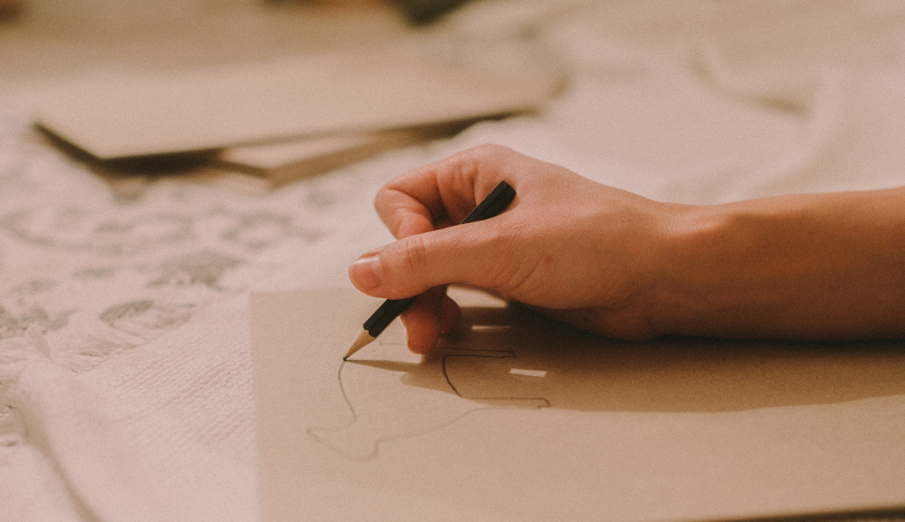
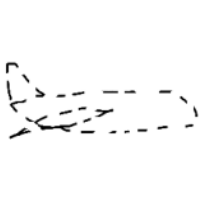
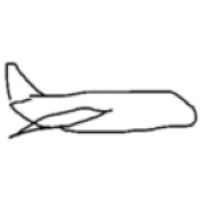
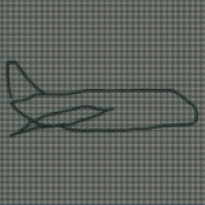
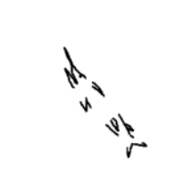
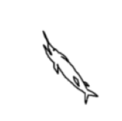
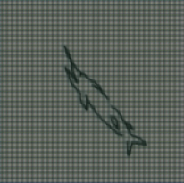
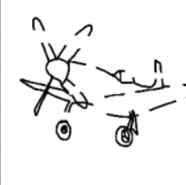
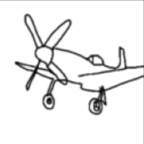
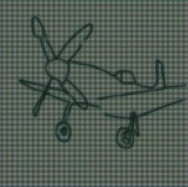

# Sketch-GAN
[CVPR](https://openaccess.thecvf.com/content_CVPR_2019/papers/Liu_SketchGAN_Joint_Sketch_Completion_and_Recognition_With_Generative_Adversarial_Network_CVPR_2019_paper.pdf) | [paperswithcode](https://paperswithcode.com/paper/sketchgan-joint-sketch-completion-and)



Pytorch implementation of the SketchGAN paper. <br>
[SketchGAN: Joint Sketch Completion and Recognition with Generative Adversarial Network](https://openaccess.thecvf.com/content_CVPR_2019/papers/Liu_SketchGAN_Joint_Sketch_Completion_and_Recognition_With_Generative_Adversarial_Network_CVPR_2019_paper.pdf)  
[Fang Liu](https://scholar.google.com/citations?user=X9iggBcAAAAJ&hl=zh-CN)<sup>1,2</sup>, [ Xiaoming Deng](https://alanspike.github.io/)<sup>1</sup>, [Yu-Kun Lai](https://scholar.google.com/citations?user=6czTBiUAAAAJ&hl=en)<sup>3</sup>, [ Yong-Jin Liu](https://www.linkedin.com/in/jiazhuo-wang-065624102)<sup>4 *</sup>, [Cuixia Ma](https://scholar.google.com/citations?user=tBIAgtgAAAAJ)<sup>1,2 *</sup>, [Hongan Wang](https://coe.northeastern.edu/people/wang-yanzhi/)<sup>1,2 *</sup>,<br>
<sup>1</sup>State Key Laboratory of Computer Science and Beijing Key Lab of Human-Computer Interaction, Institute of Software, Chinese Academy of Sciences, <sup>2</sup>University of Chinese Academy of Sciences,
<sup>3</sup>Cardiff University, 
<sup>4</sup>Tsinghua University <br>
In CVPR 2019.  

## Overview

SketchGAN is a new generative adversarial network (GAN) based approach that jointly completes and recognizes a sketch, boosting the performance of both tasks. It is used for hand-drawn sketch recognition which is a fundamental problem in computer vision, widely used in sketch-based image and video retrieval, editing, and reorganization¹. 

The paper proposes a cascade Encode-Decoder network to complete the input sketch in an iterative manner, and employs an auxiliary sketch recognition task to boost the performance of both tasks¹. 


## Prerequisites

* Python 3
* CPU or NVIDIA GPU + CUDA CuDNN

## Getting Started

### Installation

- Clone this repo:

  ```shell
  git clone git@github.com:Ashish-Abraham/Sketch_GAN.git
  cd Sketch_GAN
  ```

- Install [PyTorch](https://pytorch.org) and other dependencies (e.g., torchvision).

  ```shell
  pip install -r requirements.txt
  ```

## Data Preparation
-  Training image directory should be of the following structure
  ```
  ├── image_paths.csv

  ├── trainA
    ....
  ├── trainB
    ....
  ├── valA
    ....
  └── valB
    ....
  ```
- Folders with A suffix contain corrupted sketches and those with B contain target sketches.
- The GAN should map A->B.
- Each image.png in __B folder contains corresponding imagec.png in __A folder.
- Use data_csv_script.py to generate corresponding csv file from dataset for training.


## Model Training
The repo contains all code required to implement the GAN. Edit the scripts given or export the code in scripts to a jupyter notebook appropriately to train. Make sure cuda is available.

## Initial Results
<table cellpadding="10" cellspacing="10" >
  <tr>
    <td  align="center">Input<br> </td>
    <td  align="center">Ground Truth<br> </td>
    <td  align="center">Output<br> </td>
  </tr>
    <tr>
    <td  align="center"></td>
    <td  align="center"></td>
    <td  align="center"></td>
  </tr>
    </tr>
    <tr>
    <td  align="center"></td>
    <td  align="center"></td>
    <td  align="center"></td>
  </tr>
</table>

## Citation
```
F. Liu, X. Deng, Y. -K. Lai, Y. -J. Liu, C. Ma and H. Wang, "SketchGAN: Joint Sketch Completion and Recognition With Generative Adversarial Network," 2019 IEEE/CVF Conference on Computer Vision and Pattern Recognition (CVPR), Long Beach, CA, USA, 2019, pp. 5823-5832, doi: 10.1109/CVPR.2019.00598.
```
```
Yu, Q., Yang, Y., Liu, F. et al. Sketch-a-Net: A Deep Neural Network that Beats Humans. Int J Comput Vis 122, 411–425 (2017). https://doi.org/10.1007/s11263-016-0932-3
```
